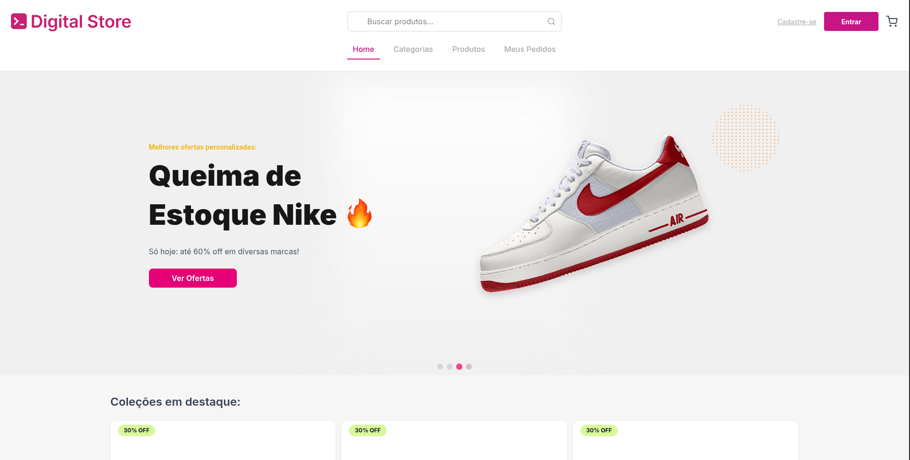
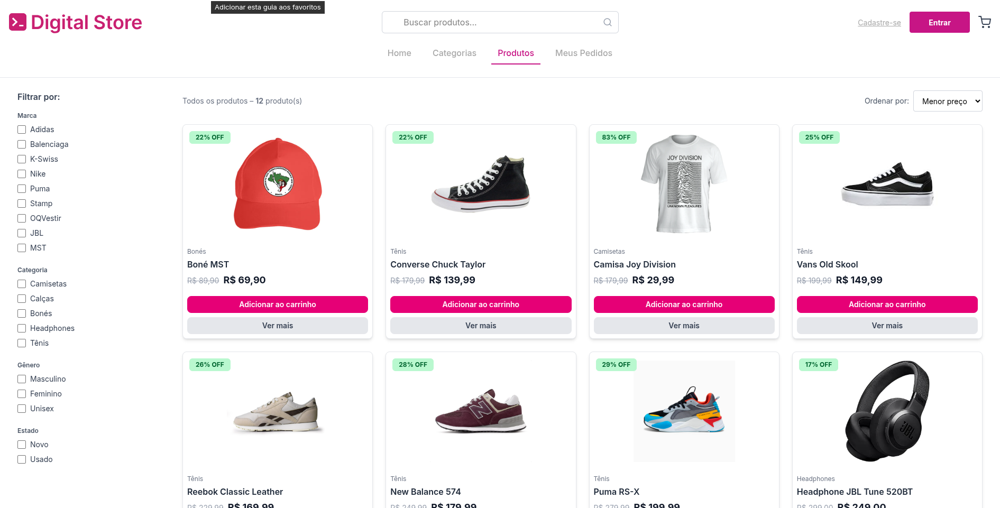
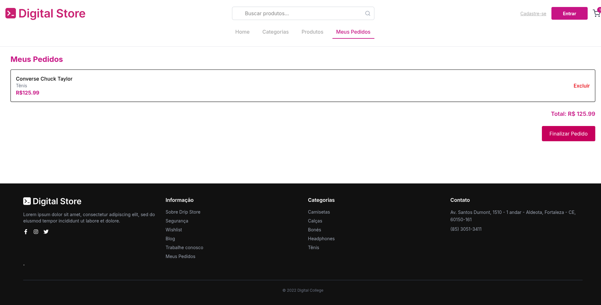

# 🛍️ Loja Drip

Projeto de front-end desenvolvido como trabalho final do curso **Full Stack - Geração Tech 3.0**.
A aplicação simula um e-commerce de roupas, com foco em experiência do usuário, navegação fluida e organização de componentes em React.

---

## 🚀 Tecnologias utilizadas

* React
* Vite
* Tailwind CSS
* Axios
* React Router

---

## ✨ Funcionalidades

* 🛒 Carrinho de compras
* 🔍 Filtro e busca de produtos
* 📦 Listagem de produtos
* 👕 Página individual de produto
* 🔐 Sistema de login (simulado)

---

## 💡 Destaques do projeto

Os principais pontos fortes da aplicação são:

* Sistema de **filtro de produtos**, proporcionando melhor experiência de navegação
* Implementação do **carrinho de compras**, com gerenciamento de estado
* Estrutura organizada utilizando boas práticas com React

---

## 🖥️ Como executar o projeto

```bash
# Clone o repositório
git clone https://github.com/Michelle-Vitoriano/drip-store.git

# Acesse a pasta
cd drip-store

# Instale as dependências
npm install

# Execute o projeto
npm run dev
```

---

## 📸 Preview

### 🏠 Home



### 👕 Produto



### 🛒 Carrinho



---

## 📌 Status do projeto

✅ Finalizado

---

## 🌐 Deploy

A aplicação está disponível online:

👉 https://drip-store-ro4vx00gv-michelle-vitoriano.vercel.app/

---

## 👩‍💻 Desenvolvido por

**Michelle Vitoriano**

* LinkedIn: https://linkedin.com/in/michelle-vitoriano
* GitHub: https://github.com/Michelle-Vitoriano

---

## 📎 Observações

Este projeto foi desenvolvido com fins educacionais, como parte da formação em desenvolvimento full stack.
